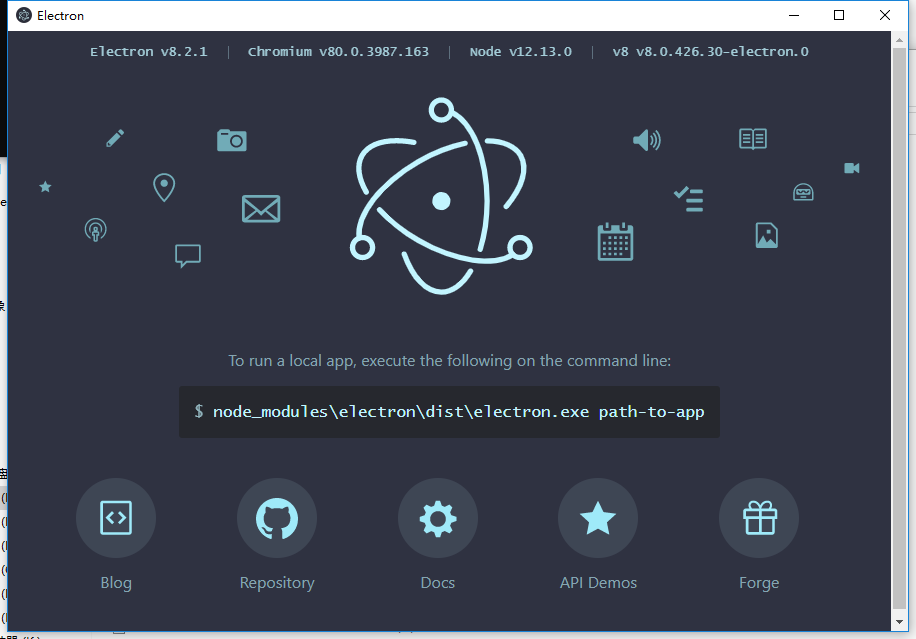

# Electron
## 安装

+ 修改npmrc文件 切换镜像源

  npmrc 位置通过下面方式打开

  > npm config edit 

> registry=https://registry.npm.taobao.org
> electron_mirror="https://npm.taobao.org/mirrors/electron/"+  

+ 安装electron

> npm install electron -g

## 快速开始

[快速开始](https://jspang.com/detailed?id=62#toc216)

## 打包

> npm install electron-packager --save-dev

+ 在项目根目录下面的package.json的scripts下面添加代码

  > "packager": "electron-packager ./ HelloWorld --all --out ./outApp --version 1.4.0 --overwrite --icon=./app/img/icon/icon.ico"

--all 可以换成 --platform=win32 --arch=ia32

+ platform 是发布平台

  > -win32指windows平台
  >
  > -linux 
  >
  > -darwin

arch=ia32  指32位windows 64位的则为x64

+ ###### 在项目中新建outApp目录

+ npm run-script packager